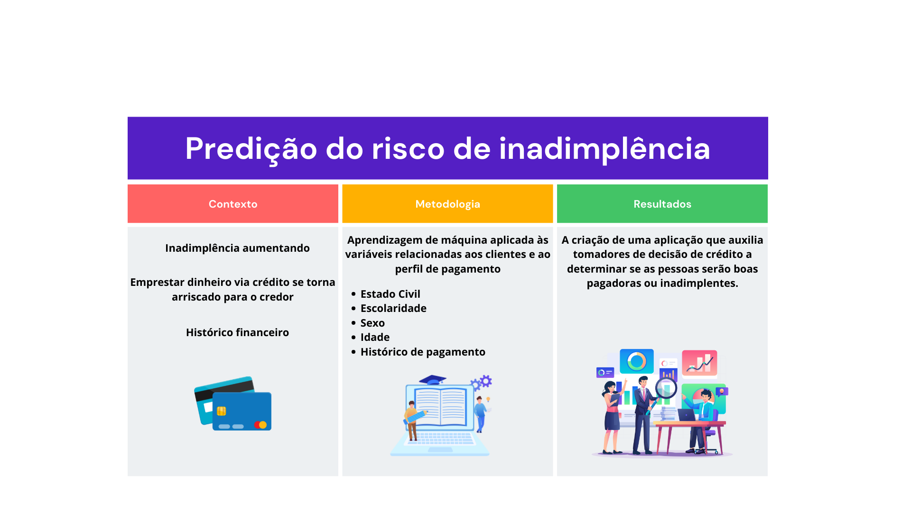

# Risk Preditction

## Resumo

O avanço da inflação e da crise econômica no Brasil na atualidade traz uma grande dificuldade para os brasileiros pagarem suas contas, especialmente no que tange o pagamento de crédito. Logo, esta alta da inadimplência traz também uma redução da arrecadação dos credores, que encontram um grande dilema: Para quem emprestar dinheiro? Como garantir que essa pessoa vai conseguir pagar o crédito tomado? Uma aplicação capaz de tomar o perfil socioeconômico dos seus potenciais clientes, assim como um histórico de pagamento e decidir se vale a pena tomar o risco do empréstimo se tornaria uma grande ferramenta a ser utilizada em bancos. Por isso, tomaremos esta ideia e utilizaremos do banco de dados [default of credit card clients](https://archive-beta.ics.uci.edu/ml/datasets/default+of+credit+card+clients) para a extração de características dos clientes.

## Resumo Gráfico

## Desenvolvedores
 - [Deiferson da Silva Moura](https://github.com/deiferson)
 - [Francisco Leocassio da Silva](https://github.com/leocassiosilva)
 - [Gabriel Lucas Silva Felix](https://github.com/gabriellfelix)
 - [Letícia Dayana de Campos](https://github.com/leticiadcampos92)
 - [Luciano Silva de Arruda](https://github.com/lucenfort)
 - [Marcello Alexandre Rodrigues Filho](https://github.com/marcelloale)
 - [Maria Luísa Leandro de Lima](https://github.com/maluwastaken)
 - [Tessele Sampaio Lopes](https://github.com/tesselesampaio)